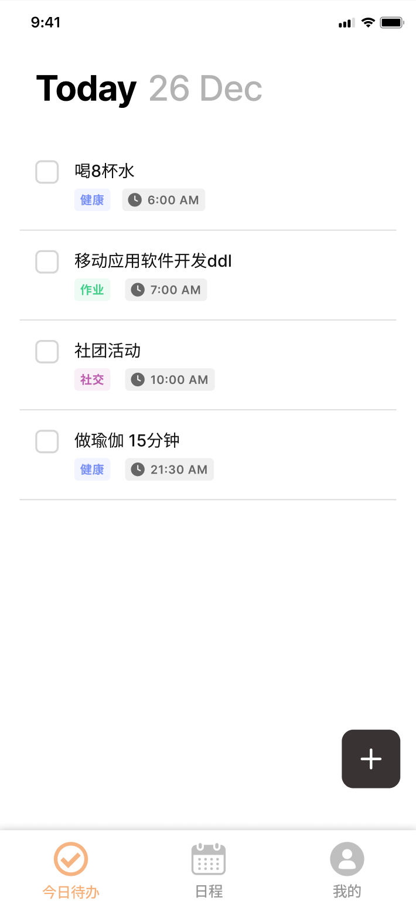
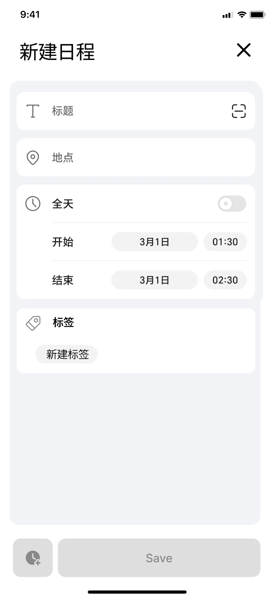
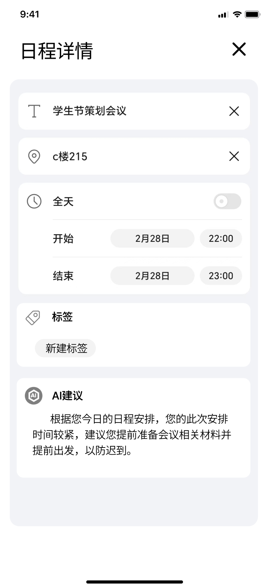
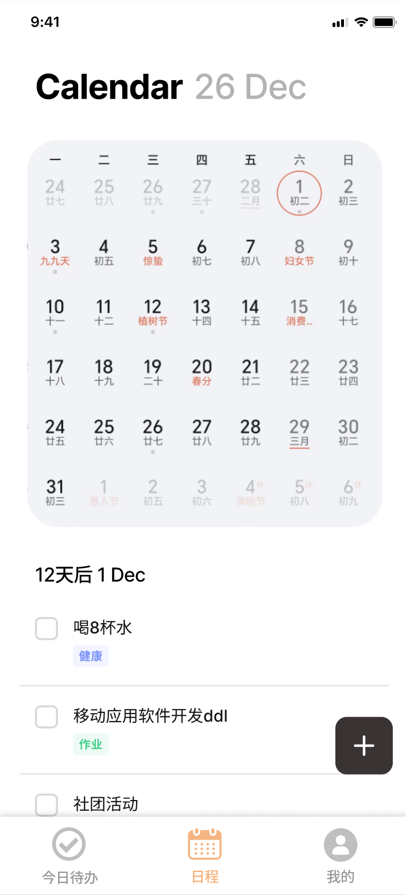
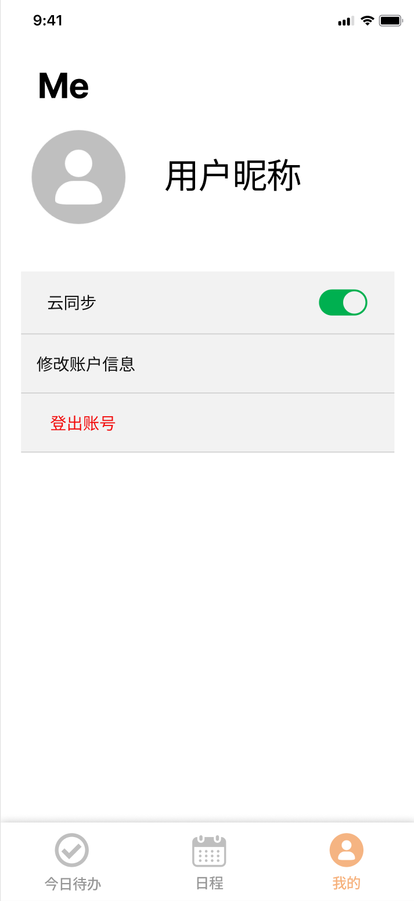

# 谋事（Planwise）项目中期文档
**文档目录**
[toc]

## 0. 官方要求（最终可删）

### 0.1 中期检查要求

4月18日（第九周周五）前：提交一份中期汇报文档，探讨解决方案，解决遇到的问题，确保项目能够顺
利完成。
具体时间地点另行通知。
项目中期文档需要包含：
- 需求分析：介绍系统的角色，用户故事与功能点清单，对于给定题目的小组，其中绝大部分需求功能点已在第2节中进行了说明，可以进行部分扩充。
- 项目主要界面的设计（可以使用原型设计工具展示，也可以直接提供程序截图）
- 项目关键的Activity和（计划）实现方式
- 项目主要模块设计（前端和后端）
- 项目实现过程中已经遇到极可能遇到的问题

### 0.2 作业要求

**功能需求**  
- 用户可以添加、删除待办事项、可以为待办事项添加类别标签、时间和地点。
- 用户可以通过点击快速修改待办事项的状态（完成/未完成）。
- 用户可以按时间顺序查看未完成的待办事项。
- 用户可以按类别筛选未完成的待办事项。
- 用户可以筛选某一时间范围内的待办事项。
- 用户可以查看全部已完成/未完成的待办事项。
- 用户可以将本地待办事项与云端进行同步。

**功能点**  
- 添加待办事项，为待办事项添加分类标签、时间、地点。
- 通过点击快速修改完成/未完成的待办事项状态。
- 按时间排序待办事项。
- 按类别筛选未完成的待办事项。
- 筛选某一时间段的待办事项。
- 查看全部已完成/未完成的待办事项。
- 将本地数据与云端同步。

## 1. 需求分析

### 1.1 用户角色分析

在谋事（Planwise）应用中，主要存在以下角色：

#### 1.1.1 学生用户

**特征**：
- 时间安排复杂，需管理课程、作业、考试和社交等活动
- 常面临截止日期压力
- 需要细致地进行代办规划和提醒

**需求**：
- 按课程科目/事件类型分类任务
- 设置截止时间避免错过截止日期
- 获取高效完成学习任务的建议

#### 1.1.2 职场人士

**特征**：
- 需要协调多个项目和会议
- 任务优先级变动频繁

**需求**：
- 工作与个人任务分类
- 基于地点和时间的任务提醒
- 提高工作效率的专业建议

#### 1.1.3 家庭管理者

**特征**：
- 管理家庭成员的各项活动和安排
- 协调家务、购物和家庭事务
- 需要灵活应对计划变更

**需求**：
- 简单直观的界面
- 按家庭成员或活动类型分类任务
- 日常事务管理的实用建议

### 1.2 用户故事

#### 1.2.1 学生用户故事

1. **作为一名高中生**，我想同时管理学校作业和课外活动，确保我不会错过任何截止日期或重要事件。
2. **作为一名大学生**，我希望能按课程类别/事件类型查看我的待办事项，这样我可以在复习特定科目时集中处理相关任务。
3. **作为一名研究生**，我需要为我的论文研究安排多个阶段性任务，并希望获得有关如何高效进行学术研究的建议。

#### 1.2.2 职场人士用户故事

1. **作为一名项目经理**，我需要追踪多个项目的进度和截止日期，并希望获得有关如何优化时间分配的建议。
2. **作为一名销售代表**，我希望按客户和地点组织我的会议和跟进任务，这样我可以在特定区域高效安排多个会面。
3. **作为一名自由职业者**，我需要管理来自不同客户的多个项目，并希望获得如何平衡工作量的建议。
4. 更多职业...

#### 1.2.3 家庭管理者用户故事

1. **作为一位家长**，我希望轻松记录和跟踪孩子的学校活动、医疗预约和课外课程。
2. **作为家庭主要采购者**，我需要管理购物清单并根据地点分类，以便高效完成多个地点的购物任务。
3. **作为家庭事务协调者**，我希望获得关于如何更高效地安排和完成家务的建议。
4. 更多家庭身份...

### 1.3 功能点清单

#### 1.3.1 待办事项管理

- 添加新的待办事项
- 删除现有待办事项
- 为待办事项添加类别标签
- 为待办事项设置时间
- 为待办事项添加地点信息
- 快速修改待办事项的完成状态

#### 1.3.2 待办事项查看与筛选

- 按时间顺序查看未完成的待办事项
- 按类别筛选未完成的待办事项
- 筛选特定时间范围内的待办事项
- 查看全部已完成的待办事项
- 查看全部未完成的待办事项

#### 1.3.3 数据同步

- 将本地待办事项数据上传至云端
- 从云端下载待办事项数据至本地
- 处理本地与云端数据冲突

#### 1.3.4 扩展功能

- 待办事项提醒通知
- 待办事项优先级设置
- 周期性/重复性待办事项
- 待办事项详细备注
- 待办事项分享功能

### 1.4 需求优先级

| 优先级 | 功能 |
|-------|------|
| 必要实现 | 待办事项的添加、删除、状态修改 待办事项的类别标签、时间和地点 按时间和类别查看筛选 查看已完成/未完成待办事项 |
| 次要功能 | 本地与云端数据同步 待办事项提醒通知 |
| 可选功能 | 待办事项优先级 周期性待办事项 详细备注 分享功能 |

## 2. 界面设计

### 2.1 今日待办
用户可以通过前面的checkbox选择该日程是否已完成。

#### 2.1.1 新建日程
在 **“今日待办”** 界面，点击右下方加号（+）即可跳转到 **“新建日程”** 界面。

#### 2.1.2 日程详情
在 **“今日待办”** 界面，点击日程对应条目，即可跳转到 **“日程详情”** 界面。
在该界面，我们的**ai小助手**会智能分析今日日程，给出合理的建议。

### 2.2 日程
在 **“日程”** 界面，您可以通过在日历中点击对应日期，来查看当天的待办及其完成情况

### 2.3 我的
在 **“我的”** 界面，您可以进行登录、登出和一些基本的设置操作。

## 3. 项目关键Activity及实现方式

### 3.1 MainActivity

**功能描述**：
- 主Activity，作为应用的入口点
- 包含底部导航栏，用于在"今日待办"、"日程"和"我的"三个主要界面之间切换
- 负责加载初始化应用必要的数据和配置

**实现方式**：
- 使用BottomNavigationView实现底部导航
- 采用Fragment架构，各主要界面作为Fragment进行加载和切换
- 通过ViewPager2与BottomNavigationView联动，实现页面滑动切换
- 使用NavController管理导航逻辑

### 3.2 TodayTodoFragment (今日待办)

**功能描述**：
- 显示当日所有待办事项
- 提供快速完成/取消完成待办事项的功能
- 支持添加新待办事项和查看详情

**实现方式**：
- 使用RecyclerView展示待办事项列表
- 采用CardView设计每个待办事项卡片
- 实现ItemTouchHelper支持左右滑动删除功能
- 使用FloatingActionButton添加新待办事项

### 3.3 AddScheduleActivity (新建日程)

**功能描述**：
- 提供表单用于创建新的待办事项
- 支持设置标题、描述、日期时间、地点和分类标签
- 保存新建的待办事项到本地数据库

**实现方式**：
- 使用MaterialDatePicker和MaterialTimePicker选择日期和时间
- 采用自定义ChipGroup实现分类标签选择
- 使用PlacesAPI或自定义地点选择器实现地点选择
- 通过ViewModel进行数据处理和持久化

### 3.4 ScheduleDetailActivity (日程详情)

**功能描述**：
- 显示待办事项的详细信息
- 提供编辑和删除操作
- 集成AI小助手提供智能建议

**实现方式**：
- 使用ConstraintLayout构建详情页面布局
- 通过Intent接收待办事项ID并加载详细数据
- 实现本地AI模型或调用云端API提供智能建议
- 使用动画效果增强用户体验

### 3.5 CalendarFragment (日程)

**功能描述**：
- 提供月历视图展示各日期的待办事项情况
- 支持选择日期查看特定日期的待办事项
- 显示待办事项完成情况统计

**实现方式**：
- 使用第三方日历控件（如CalendarView或自定义控件）
- 实现日期标记功能，显示有待办事项的日期
- 使用RecyclerView展示选中日期的待办事项列表
- 通过Room数据库查询特定日期的待办事项

### 3.6 ProfileFragment (我的)

**功能描述**：
- 提供用户个人信息管理
- 支持登录、注册和退出登录
- 提供应用设置和数据同步选项

**实现方式**：
- 使用SharedPreferences存储用户偏好设置
- 实现Firebase Authentication或自定义认证系统
- 使用WorkManager实现后台数据同步
- 采用PreferenceFragmentCompat构建设置界面

### 3.7 数据层实现

**本地存储**：
- 使用Room数据库存储待办事项数据
- 设计Schedule实体类管理待办事项信息
- 实现DAO接口进行数据库操作

**云端同步**：
- 使用Retrofit与后端API交互
- 实现Repository模式管理本地和远程数据源
- 采用WorkManager处理定期同步和冲突解决

### 3.8 架构设计

**整体架构**：
- 采用MVVM架构模式
- 使用ViewModel管理UI相关数据
- 通过LiveData实现数据驱动的UI更新
- 使用Coroutines处理异步操作
- 采用依赖注入(Hilt/Dagger)简化组件间依赖

**组件交互**：
- Fragment间通过共享ViewModel通信
- Activity跳转通过Intent传递数据
- 使用EventBus或LiveData实现组件间事件通知